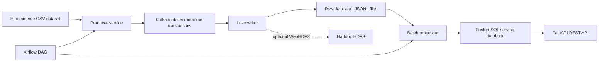

# Scalable Batch Processing Data Architecture for ML Applications

This project is a runnable conception-phase implementation of a batch data architecture for an e-commerce machine learning dataset. It includes Kafka-based ingestion, raw data-lake persistence, batch aggregation, PostgreSQL serving tables, a REST API, and an Airflow DAG skeleton for monthly ingestion plus quarterly aggregation cycles.

## Architecture



The default local flow uses the shared `data/` volume as the raw data lake so the project can run reliably on a laptop. Hadoop HDFS services are included in Docker Compose, and the lake writer can push files through WebHDFS when `HDFS_NAMENODE_WEBHDFS_URL` is configured.

## Requirements

- Docker Desktop with Docker Compose
- Python 3.11+ for local utility scripts and tests

## Quick Start

Make sure Docker Desktop is running before starting the stack. On Windows, use Linux containers.

1. Copy the environment file:

   ```powershell
   Copy-Item .env.example .env
   ```

2. Generate sample e-commerce data:

   ```powershell
   python scripts/generate_sample_data.py --rows 10000 --output data/raw/ecommerce_sample.csv
   ```

3. Start the core stack:

   ```powershell
   docker compose up --build -d postgres kafka api
   ```

4. Run ingestion into Kafka:

   ```powershell
   docker compose run --rm producer
   ```

5. Persist Kafka messages into the raw lake:

   ```powershell
   docker compose run --rm lake-writer
   ```

6. Run the batch processor:

   ```powershell
   docker compose run --rm processor
   ```

7. Query the API:

   ```powershell
   Invoke-RestMethod http://localhost:8000/health
   Invoke-RestMethod http://localhost:8000/metrics/summary
   Invoke-RestMethod http://localhost:8000/metrics/products/top
   ```

## Full Architecture Services

Start Hadoop, Spark, and Airflow profile services when you want to demonstrate the broader architecture:

```powershell
docker compose --profile full up --build -d
```

Airflow is exposed at `http://localhost:8080` with username/password `airflow` / `airflow`.

## Dataset

For the final report, use a Kaggle e-commerce dataset with more than 1 million records. Place the CSV at:

```text
data/raw/ecommerce_sample.csv
```

Expected columns:

- `invoice_no`
- `stock_code`
- `description`
- `quantity`
- `invoice_date`
- `unit_price`
- `customer_id`
- `country`

The included generator creates compatible sample data for local testing.

## API Endpoints

- `GET /health`
- `GET /metrics/summary`
- `GET /metrics/countries`
- `GET /metrics/products/top?limit=10`
- `GET /features/customer-rfm?limit=100`

## Project Layout

```text
api/                 FastAPI serving layer
producer/            Kafka producer and lake writer
processor/           Batch aggregation job
airflow/dags/        Monthly and quarterly orchestration DAG
database/            PostgreSQL schema
scripts/             Local setup and data generation helpers
tests/               Unit tests
data/raw/            Input CSV and raw ingested JSONL files
data/processed/      Processor outputs
docs/                Architecture notes
```

## Validation

Run static syntax checks locally:

```powershell
python -m compileall api producer processor scripts tests
```

Run tests after installing test dependencies:

```powershell
python -m pip install -r requirements-dev.txt
pytest
```

## Troubleshooting

- `open //./pipe/dockerDesktopLinuxEngine: The system cannot find the file specified`: start Docker Desktop and wait until it reports that the engine is running.
- `pytest is not recognized`: install development dependencies with `python -m pip install -r requirements-dev.txt`.
- Empty API responses: run the producer, lake writer, and processor steps after PostgreSQL and Kafka are healthy.
